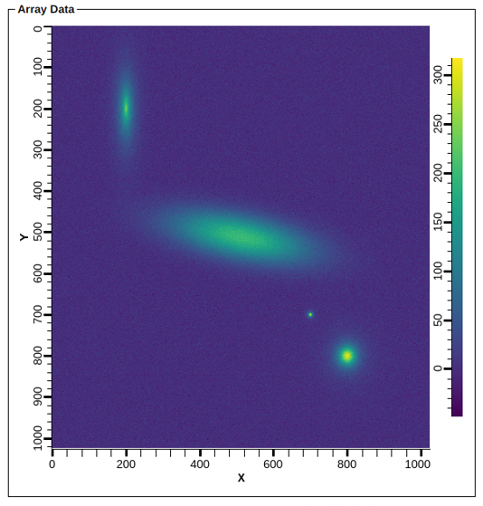

# ADSimPeaks

EPICS areaDetector driver to simulate detector peaks with background 
and noise in 1D or 2D.

## Description

This areaDetector driver can be used to simulate semi-realistic diffraction
data in 1D and 2D. It can produce a 1D or 2D NDArray objects of variable size and 
of different data types. The data can contain a background profile and any number 
of peaks of a few different shapes, with the option to add different kinds of 
noise to the signal. The driver can integrate the data over time for multiple NDArray objects. 

The background type can either be a 3rd order polynomial, so that the shape can be 
a flat offset, a slope or a curve, or an exponential with a slope and offset. 

The noise type can be either uniformly distributed or distributed
according to a Gaussian profile. 

The peaks are mostly modelled using continuous probability distribution functions that 
are commonly used to fit experimental data, although there are a few simple shapes and 
a smooth step function. 

Supported 1D peak shapes are:
1) Square
2) Triangle
3) [Gaussian](https://en.wikipedia.org/wiki/Normal_distribution) (normal)
4) [Lorentzian](https://en.wikipedia.org/wiki/Cauchy_distribution) (also known as Cauchy)
5) [Voigt](https://en.wikipedia.org/wiki/Voigt_profile) (implemented as a psudo-Voigt)
6) [Laplace](https://en.wikipedia.org/wiki/Laplace_distribution)
7) [Moffat](https://en.wikipedia.org/wiki/Moffat_distribution)
8) [Smooth Step](https://en.wikipedia.org/wiki/Smoothstep)

Supported 2D peak shapes are:
1) Square
2) Pyramid
3) Eliptical Cone
4) [Gaussian](https://en.wikipedia.org/wiki/Normal_distribution) (normal)
5) [Lorentzian](https://en.wikipedia.org/wiki/Cauchy_distribution) (also known as Cauchy)
6) [Voigt](https://en.wikipedia.org/wiki/Voigt_profile) (implemented as a psudo-Voigt)
7) [Laplace](https://en.wikipedia.org/wiki/Laplace_distribution)
8) [Moffat](https://en.wikipedia.org/wiki/Moffat_distribution)
9) [Smooth Step](https://en.wikipedia.org/wiki/Smoothstep)

The peaks are defined by several parameters:

* Center position
* Full width half maximum (FWHM)
* Amplitude
* Lower / upper boundary
* Two additional general purpose parameters 

The amplitude can be positive or negative, and the center position can be defined outside of the range of the array. Setting the lower and upper boundaries can be useful in case a hard edge is needed or we want to save on CPU cycles (since most of the peak types are continuous functions that stetch out to infinity). 

The two following screenshots are an example of the types of plots that can be created by this driver. 




## Getting Started

There are two example IOC applications packaged with this module:

* example - 1D ADSimPeaks example
* example2d - 2D ADSimPeaks example

### IOC startup script

The IOC applications demonstrate how to instantiate the driver. The same function is used for both 1D and 2D data, with a 2D driver being setup if the Y dimension is non-zero. 

For 1D data (max size = 65536) the driver is instantiated in the IOC startup script like:
```
# Arguments:
# 1 - Asyn port name
# 2 - Maximum size of the NDArray X dimension
# 3 - Maximum size of the NDArray Y dimension (set to 0 for 1D data)
# 4 - Maximum number of peaks (which defines the maximum number of Asyn addresses)
# 5 - Starting data type for the NDArray object (NDDataType_t)
# 6 - Maximum buffers (0 = unlimited)
# 7 - Maximum memory (0 = unlimited)
# 8 - Priority (0 = default)
# 9 - Stack Size (0 = default)
ADSimPeaksConfig(D1.SIM,65536,0,10,3,0,0,0,0)
```

And for 2D data (1024 x 1024) it would be:
```
ADSimPeaksConfig(D2.SIM,1024,1024,10,3,0,0,0,0)
```

In both the above cases the data type is UInt16. The ```NDDataType_t``` enum can be found in the areaDetector documentation, however the driver supports changing the data type at runtime.  

The example IOC applications also use the areaDetector PVAccess plugin to export the data over PVAccess for visualization in a client application. For example:
```
NDPvaConfigure(D1.PV1,100,0,D1.SIM,0,"ST99:Det:Det1:PV1:Array",0,0,0)
```
where ```ST99:Det:Det1:PV1:Array``` is the name of the PVAccess channel used to access the NTNDArray object. If you need to use Channel Access, then use the ```StdArrays``` plugin instead.

### Setting up the database

The example IOC applications build the EPICS database using substitution files. For example, the database for the 1D driver can be built using:
```
file ADSimPeaks.template
{
pattern {P, R, PORT, ADDR, TIMEOUT}
        {ST99:Det, :Det1:, D1.SIM, 0, 1}
}

file ADSimPeaks1DBackground.template
{
pattern {P, R, PORT, ADDR, TIMEOUT}
        {ST99:Det, :Det1:, D1.SIM, 0, 1}
}

file ADSimPeaks1DPeak.template
{
pattern {P, R, PORT, ADDR, TIMEOUT, PEAK}
        {ST99:Det, :Det1:, D1.SIM, 0, 1, 0}
        {ST99:Det, :Det1:, D1.SIM, 0, 1, 1}
        {ST99:Det, :Det1:, D1.SIM, 0, 1, 2}
        {ST99:Det, :Det1:, D1.SIM, 0, 1, 3}
        {ST99:Det, :Det1:, D1.SIM, 0, 1, 4}
        {ST99:Det, :Det1:, D1.SIM, 0, 1, 5}
        {ST99:Det, :Det1:, D1.SIM, 0, 1, 6}
        {ST99:Det, :Det1:, D1.SIM, 0, 1, 7}
}
```

There are similar database template files for the 2D case (```ADSimPeaks2DBackground.template``` and ```ADSimPeaks2DPeak.template```). As shown above, the ```ADSimPeaks1DPeak.template``` or ```ADSimPeaks2DPeak.template``` files should be instantiated for each peak that will need to be configured. 

The example database substitution files also demonstrate how to use the database template for the pvaPlugin support. 

There is an additional database template file used in the example IOC applications to deal with autosave status. In addition, the busy record support is also needed. So these examples also require the use of those modules, which are common EPICS modules (see the [Useful Links](#useful-links) section).

## Usage

The driver makes use of a few standard records inherited from ```ADBase.template```.

| Record Name | Read/Write/1D/2D | Description |
| ------ | ------ | ------ |
| $(P)$(R)Acquire | Read/Write/1D/2D | Start (1) or Stop (0) the simulation |
| $(P)$(R)AcquirePeriod | Read/Write/1D/2D | This is used to define a delay between the generation of each simulation NDArray. Set this to zero to run as fast as possible. |
| $(P)$(R)SizeX | Read/Write/1D/2D | This is the size of the next NDArray in the X dimension |
| $(P)$(R)SizeY | Read/Write/2D | This is the size of the next NDArray in the Y dimension (2D Only) |
| $(P)$(R)DataType | Read/Write/1D/2D | This is the data type of the next NDArray (UInt8, UInt32, Float64, etc.) |
| $(P)$(R)ImageMode | Read/Write/1D/2D | This controls how the driver operates. 'Single' means only one NDArray is generated. 'Multiple' means that only a particular number of NDArrays will be generated (as defined by $(P)$(R)NumImages), and 'Continuous' means it will run until $(P)$(R)Acquire is set to 0. The 'Multiple' acquisition can also be aborted by setting $(P)$(R)Acquire to 0. |
| $(P)$(R)NumImages | Read/Write/1D/2D | Used to define the number of NDArrays to generate when $(P)$(R)ImageMode is set to 'Multiple' |


## Examples

TBD

## Developer

The build has been tested on Red Hat Enterprise Linux 8 with:

* EPICS base 7.0.6.1
* Asyn R4-43
* areaDetector ADCore R3-11

The bundled example IOC applications require the use of EPICS 7 as they use the QSRV module to export data over PVAccess. However, the ADSimPeaks driver itself should work with EPICS 3.14.12.X and 3.15.X as long as a recent version of Asyn and areaDetector are used.  

The project requires a reasonably modern C++ compiler (C++11 or newer). 

List of main classes (header files and source files):

ADSimPeaks - the main areaDetector (inherits from ADBase)   
ADSimPeaksPeak - contains the implementation of the various peak shapes  
ADSimPeaksData - container class to hold peak information  

## License

Copyright 2021, UT-Battelle, LLC  
All rights reserved  
OPEN-SOURCE LICENSE  

(see the LICENSE file)

## Userful Links

1. [EPICS](https://epics-controls.org/)
2. [Asyn Module](https://github.com/epics-modules/asyn)
3. [areaDetector Project](https://github.com/areaDetector)
4. [busy record](https://github.com/epics-modules/busy)
5. [autosave support](https://github.com/epics-modules/autosave)

## Contact

Submit a ticket to the project, or for general help contact the EPICS Tech-Talk mailing list.

